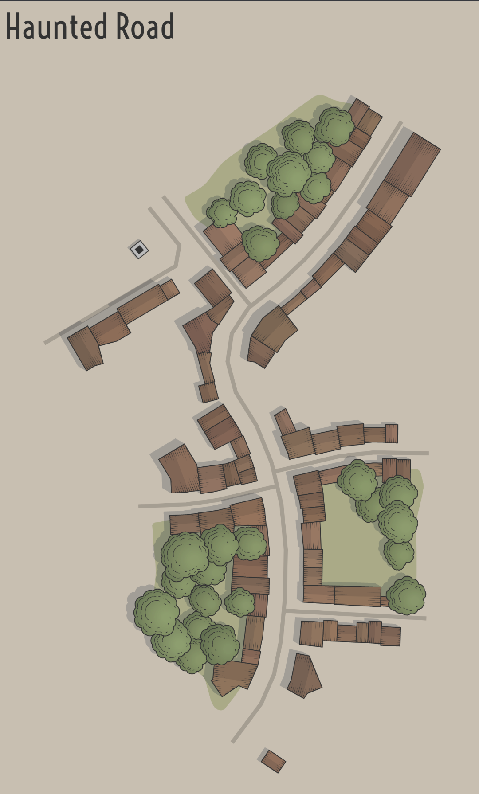
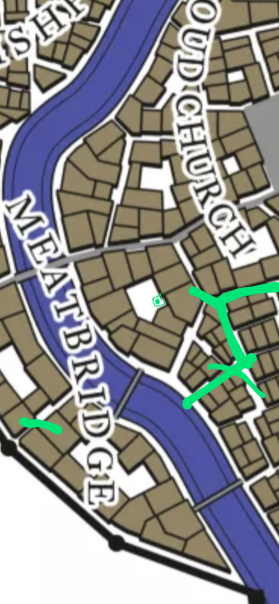

Grevnyrch
=========
The world of Grevnyrch (/ɡreːvə/ - /ˈnir CH/) is a newly discovered realm, which hosts the infamous city of Kla'Bbbert.
The city is ruled by the Conch O'Bar (/käNGk /ō/ /bär/) Crime Syndicate.
Here adventurers find fame in fortune as easily as the find woe and despair, and it hosts a lowly troupe that are in for a tumble of suprise!

World Map
---------
[1]

 [1]

City Map - Kla'Bbbert
---------------------

[2]

City Districts
--------------

### Haunted Road

1. The Blue Thief - Inn and Pub -- favorite hangout of the party
2. Sew & Tell - Clothing and Tailor Shop

### See the City in 3D
1. Download the JSON [here](./klabbbert.json)
2. Go to the [City Viewer](https://watabou.itch.io/city-viewer)
3. Upload the JSON and enjoy!

Tools
=====
1. [GLS Logger](https://actuallyfro.github.io/Grevnyrch/02_GLSL/GLSL.html)
2. [Bounty Generator](https://actuallyfro.github.io/Grevnyrch/04_Tools/Bounty_Generator.html)
3. [Voice Generator](https://actuallyfro.github.io/Grevnyrch/04_Tools/Voice_Generator.html)
4. [Initiative.sh](https://initiative.sh/)
5. [Treasure - Donjon](https://donjon.bin.sh/5e/random/#type=treasure;cr=0;loot_type=Individual%20Treasure?refer_by=scabard.com)
6. [Fantasy Names Generator](https://www.fantasynamegenerators.com/shop-names.php)

### Name Generator:
1. [Name Generator - Inns](https://www.fantasynamegenerators.com/inn-names.php)
2. [Name Generator - Shops](https://www.fantasynamegenerators.com/shop-names.php)
3. [NPC Name/features](https://initiative.sh/) Run command: `npc`
4. [Shop Generator](https://www.thievesguild.cc/shops/)

Known, but not used
-------------------
1. [Dave's Mapper - Online Dungeon Builder](https://davesmapper.com/dungeon)
2. [Encounter Builder - Kolod Fight Club](https://kobold.club/fight/#/encounter-builder)
3. [Encounter Builder - Goblinist](http://tools.goblinist.com/5enc)
4. [Encounter Builder - Donjon](https://donjon.bin.sh/5e/random/#type=encounter;n_pc=4;level=1;difficulty=any;environment=Underdark)
5. [Treasure - Redkat's Tools](http://redkatart.com/dnd5tools/?refer_by=scabard.com#treasureBox)

Reference Materials
===================
1. [D&D official Monsters by CR](https://media.wizards.com/2014/downloads/dnd/MM_MonstersCR.pdf)
2. [D&D official Monsters List](https://media.wizards.com/2017/dnd/downloads/DnDMonsterLists.pdf)
3. [D&D SRD](https://media.wizards.com/2016/downloads/SRD-OGL_V1.1.pdf)

Known, but not used
-------------------
1. [Customizing Backgrounds](https://roleplayersrespite.com/custom-backgrounds-dnd-5e)
2. [Anglo Saxon Runes (for potential symbols in GLS)](https://en.m.wikipedia.org/wiki/Anglo-Saxon_runes)

Credits
=======
1. [Fractal World Generator](https://donjon.bin.sh/code/world/) for World Map
2. [Medieval Fantasy City Generator](https://watabou.itch.io/medieval-fantasy-city-generator) for City Map
